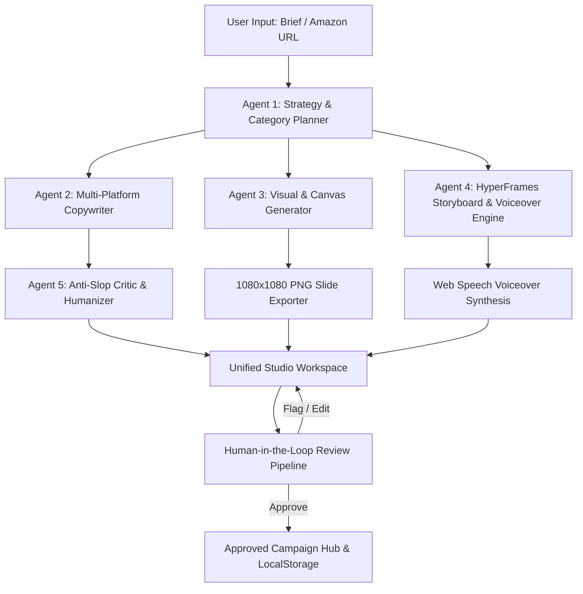

# ⚡ TrendForge AI — Autonomous Multi-Modal Content Studio

> **National AI Build Challenge 2026** · **Track PS-02: Multi-Modal Autonomous Content Studio**  
> Built by **Team AgentX** (Sarvajanik College of Engineering & Technology - SCET & SSASIT, Surat)  
> **Lead Builder & Architecture:** Yash Badgujar

[](https://github.com/YashBadgujar15/trendforge-ai)
[](https://github.com/YashBadgujar15/trendforge-ai)
[](https://github.com/YashBadgujar15/trendforge-ai)
[](LICENSE)

---

## 🌟 Overview: What is TrendForge AI?

Marketing teams, D2C brands, and solo creators face a massive bottleneck: converting a single product brief or e-commerce URL into a cohesive, platform-native multimedia campaign takes **6 to 12 hours** across disparate tools (ChatGPT for copy, Canva for carousels, ElevenLabs for voiceover, CapCut for reels, and Notion for approvals).

**TrendForge AI solves this in under 60 seconds.**

With a single product prompt or e-commerce link (Amazon, Flipkart, Shopify), TrendForge AI orchestrates a **5-Agent Autonomous Content Engine** that generates:
1. **Platform-Native Copy:** LinkedIn Thought Leadership, 𝕏 (Twitter) viral thread, and Instagram captions with tailored hashtags.
2. **Interactive 1080×1080 Carousel Slides:** Direct PNG slide export rendered locally on HTML5 Canvas.
3. **HyperFrames™ 60 FPS Reel Storyboards:** Cinematic scene-by-scene storyboard with real-time **Web Speech API AI Voiceover** and synchronized subtitles.
4. **Anti-Slop™ Critic & Humanizer:** Scans generated copy for overused AI buzzwords ("delve", "testament", "tapestry"), scores AI confidence, and provides one-click humanization.
5. **Human-in-the-Loop Lifecycle:** Real approval pipeline (`Pending Review` ➔ `Approved` ➔ `Draft`), with instant local persistence and workspace tracking.

---

## 🚀 Killer Features & Innovations

### 1. 🛒 Smart E-Commerce URL & Product Extractor
* Paste any product URL from **Amazon, Flipkart, or Shopify**.
* Built-in intelligent URL slug & category parser extracts product name, brand attributes, target audience, and market niche without requiring expensive third-party scraping APIs.

### 2. 🎬 HyperFrames™ Reel Engine with Real AI Voiceover
* Full 60 FPS CSS3 animated video storyboard with scene timers, transitions, and audio waveforms.
* Integrated with the native **Browser Web Speech API** to synthesize realistic AI voiceovers scene-by-scene with real-time synchronization.

### 3. 🎨 Canvas-Powered 1080×1080 Graphic Exporter
* High-resolution graphics rendered via HTML5 2D Canvas.
* One-click **"Download Slide as PNG"** produces production-ready social media assets directly in the browser with 0 ms server lag.

### 4. 🛡️ Anti-Slop™ Audit Engine
* Detects AI filler phrases, robotic tone markers, and cliché structures.
* Provides a real-time **Slop Index (0% to 100%)** and a one-click **"De-Slopify"** button to replace generic phrases with high-converting, humanized hooks.

### 5. ✨ Astra AI Copilot HUD (v4.2)
* Inspired by modern tech interfaces (OpenAI, Linear, Astra).
* Floating ambient HUD with dynamic particle aura, synthesized sci-fi audio chimes (Web Audio API), pre-configured viral campaign presets (e.g. *Surat Diamond Bourse Smart Ring*), and one-click bridge into the generation studio.

---

## 🧠 System Architecture

TrendForge AI employs an autonomous multi-agent pipeline operating entirely client-side with optional BYOK (Bring-Your-Own-Key) Gemini 1.5 Flash support:



### Agent Roles:
| Agent | Responsibility | Output |
|---|---|---|
| **Planner Agent** | Parses product URLs, detects product category, determines tone & audience | Structured Strategy Brief |
| **Copywriter Agent** | Generates platform-tailored copy for LinkedIn, 𝕏, and Instagram | Structured Markdown & Tagsets |
| **Visual Agent** | Formats visual slides with brand gradients and typography | HTML5 1080×1080 Canvas Assets |
| **HyperFrames Agent** | Generates scene-by-scene storyboard, voiceover script, and timestamps | 60 FPS Animated Player + Audio |
| **Critic Agent** | Audits copy against 40+ AI buzzwords and calculates Slop Index | Quality Score & Humanized Edits |

---

## 🛠️ Technology Stack

* **Frontend:** Vanilla HTML5, CSS3 (Glassmorphism, CSS Grid, Custom Design Tokens), Vanilla JavaScript (ES6+).
* **Multi-Modal Audio:** Native Web Speech Synthesis API & Web Audio API (Synthesized SFX without external audio files).
* **Graphics Rendering:** HTML5 2D Canvas Engine (1080×1080px export).
* **Storage & Persistence:** Client-side Storage Pipeline (`localStorage` synchronization across Studio & Campaigns).
* **AI Provider:** Multi-tier — Native Autonomous Pattern Engine (100% offline-ready) + Optional BYOK Google Gemini 1.5 Flash integration.
* **Testing & Verification:** Chrome DevTools Protocol (CDP) automated test suites.

---

## ⚡ Quick Start & Local Run

No `npm install`, no heavy Docker containers, and no complex setup required. TrendForge AI runs instantly on any standard modern browser.

### Option 1: Double Click (Windows)
Double-click `start.bat` in the repository root. It starts a lightweight local server and automatically opens `index.html`.

### Option 2: Python HTTP Server
```bash
# Clone the repository
git clone https://github.com/YashBadgujar15/trendforge-ai.git

# Navigate into directory
cd trendforge-ai

# Start local server
python -m http.server 8000

# Open in browser: http://localhost:8000
```

### Option 3: Direct File Launch
Simply double-click `index.html` in your file explorer to run the entire studio offline!

---

## 👥 Team AgentX (Credits)

| Name | Role | Institution |
|---|---|---|
| **Yash Badgujar** | Lead Builder, Full-Stack Architecture & Multi-Modal Engines | SCET, Surat |
| **Anjali Sonar** | Multi-Agent Orchestration & Prompt Engineering | SCET, Surat |
| **Pranav Jogi** | Multi-Modal Visuals & Animation Engineering | SSASIT, Surat |

*Submitted for National AI Build Challenge 2026 · Track PS-02.*
